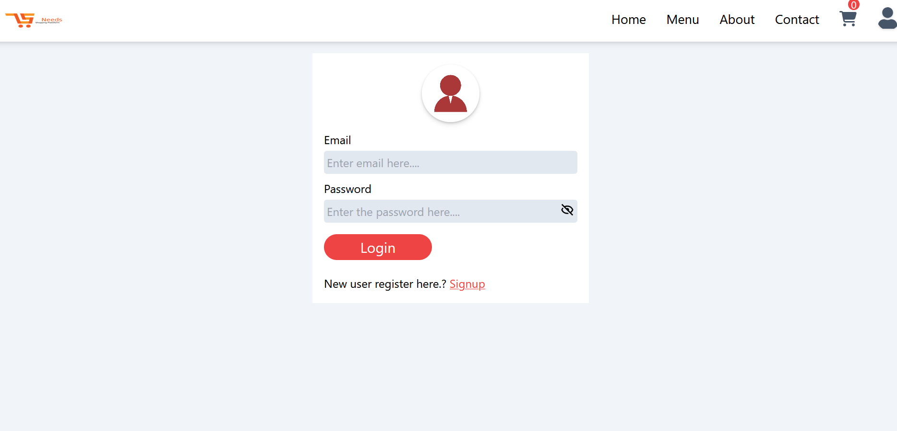
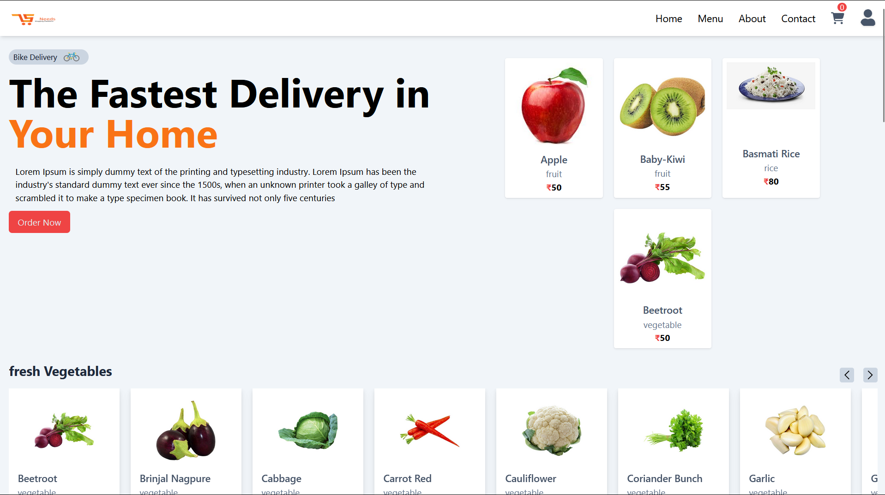
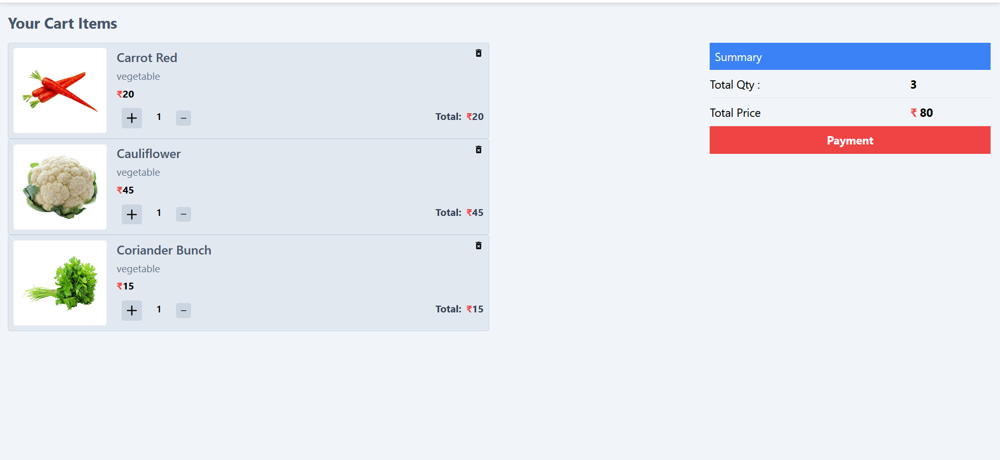
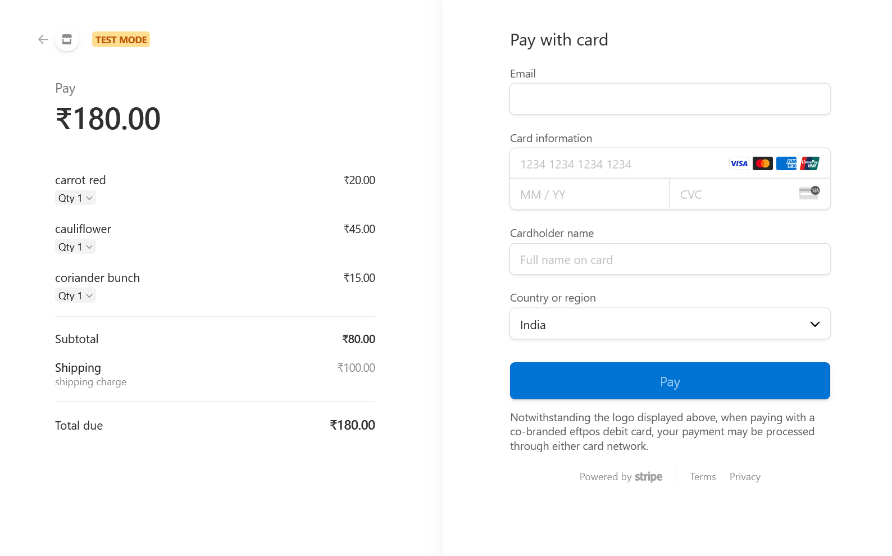

# Restaurant MERN App

A full-stack restaurant management application built using the MERN (MongoDB, Express, React, Node.js) stack. This application uses Tailwind CSS for styling and integrates Stripe for payment processing.

### Screenshots

## SignUp page

## Login page

## Home page

## cart page

## payment page

## Features

- User authentication and authorization
- CRUD operations for product management
- Order management
- Stripe payment integration
- Responsive design using Tailwind CSS

## Technologies Used

- MongoDB
- Express.js
- React.js
- Node.js
- Tailwind CSS
- Stripe API